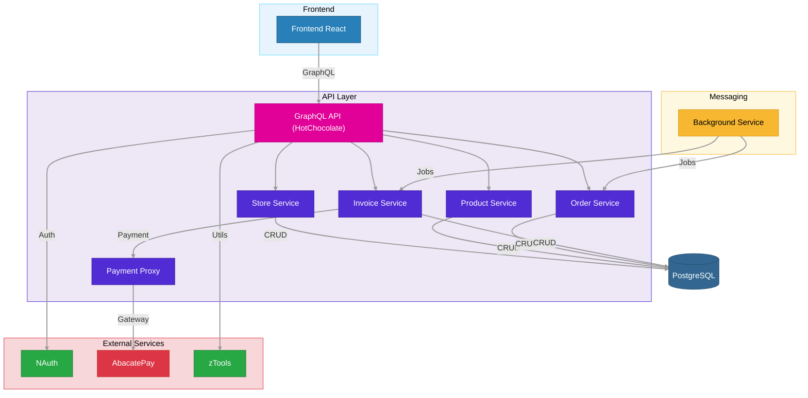

# System Design Diagram Generator

You create system design / architecture diagrams in Mermaid syntax (`.mmd`) following a strict visual standard with colored subgraphs and nodes.

## Input

The user may provide a project name or description as argument: `$ARGUMENTS`

If no arguments are provided, ask the user what system they want to diagram.

## Color Palette Reference

### Subgraph (area) backgrounds
| Area | Fill | Stroke |
|------|------|--------|
| Frontend | `#e8f4fd` | `#61DAFB` |
| API | `#ede7f6` | `#512BD4` |
| Messaging | `#fff8e1` | `#f7b731` |
| External Services | `#f8d7da` | `#dc3545` |

### Node fills
| Type | Fill | Stroke | Text |
|------|------|--------|------|
| Web site / web app | `#2980b9` | `#1a5276` | `#fff` |
| Mobile app | `#e74c3c` | `#c0392b` | `#fff` |
| Package / lib (NuGet, NPM) | `#c0392b` | `#96281B` | `#fff` |
| .NET Controller / service | `#512BD4` | `#3a1d9e` | `#fff` |
| GraphQL / special feature | `#E10098` | `#b3007a` | `#fff` |
| Messaging server (RabbitMQ, etc) | `#f7b731` | `#d4991a` | `#000` |
| Database | `#336791` | `#264d6e` | `#fff` |
| Internal microservice | `#28a745` | `#1e7e34` | `#fff` |
| External API / service | `#dc3545` | `#c0392b` | `#fff` |
| Background worker | `#f7b731` | `#d4991a` | `#000` |

### Link style
```
linkStyle default stroke:#999,stroke-width:2px
```

## Architecture Rules

### 1. Frontend Area (light blue background)
- Subgraph name: `Frontend`
- Style: `fill:#e8f4fd,stroke:#61DAFB,color:#000`
- Inside, color each node by type:
  - **Web sites / web apps** → blue (`#2980b9`)
  - **Mobile apps** → light red (`#e74c3c`)
  - **Packages / libs** (NuGet, NPM) → dark red (`#c0392b`)
- Frontend connects to the API via REST, GraphQL, or WebSocket (label the edge)

### 2. API Area (very light purple background)
- Subgraph name: `API` (with label if needed, e.g., `API["API Layer"]`)
- Style: `fill:#ede7f6,stroke:#512BD4,color:#000`
- For .NET projects, create **one node per Controller** (purple `#512BD4`)
- Special features (auth handler, middleware, etc.) get a different color within the area
- Controllers that access a database → arrow to the DB node
- Controllers that call external services or microservices → arrow to that service

### 3. Messaging Area (yellow background) — only if the system uses queues
- Subgraph name: `Messaging`
- Style: `fill:#fff8e1,stroke:#f7b731,color:#000`
- Place the messaging server node inside (e.g., RabbitMQ)
- On the arrow TO the server, write the queue or exchange name
- Background workers/consumers also go here

### 4. Database — standalone (no subgraph)
- Use cylinder shape: `DB[("PostgreSQL")]`
- Style: `fill:#336791,stroke:#264d6e,color:#fff`
- Placed outside any subgraph

### 5. External Services Area (light red background)
- Subgraph name: `External` (with label `External["External Services"]`)
- Style: `fill:#f8d7da,stroke:#dc3545,color:#000`
- Inside:
  - **Internal microservices** (NAuth, zTools, NNews, etc.) → green (`#28a745`)
  - **External APIs / third-party services** (Stripe, AbacatePay, Twitter, etc.) → red (`#dc3545`)
- On arrows to internal microservices, specify what will be used (e.g., `|"Email"|`, `|"S3"|`, `|"Auth"|`, `|"IA"|`)

### 6. Click callbacks
- Only **internal microservices** (green nodes like NAuth, zTools, NNews, BazzucaMedia, Lofn, ProxyPay) get click callbacks: `click NodeId mermaidCallback "NodeId"`
- Do NOT add click callbacks to frontend apps, API controllers/services, databases, external APIs, background workers, or any other non-microservice node
- This enables diagram navigation — clicking a microservice navigates to its own system design diagram

### 7. General rules
- Direction: `graph TD` (top-down)
- No emojis in labels
- Use meaningful node IDs (not A, B, C)
- Label all arrows with the protocol, action, or purpose
- Always end with `linkStyle default stroke:#999,stroke-width:2px`

## Output Location

- Default directory: `emagine-site/src/data/diagrams/`
- File name: `<project-slug>.mmd` (kebab-case)
- Only generate the `.mmd` file (no PNG needed — the site renders Mermaid directly)

## Complete Example

Below is a full example for a payment proxy system with React frontend, GraphQL API, background workers, and external services:



## Instructions

### Phase 1 — Understand the System
1. If the user specifies a project, look for its GitHub repos or existing code to understand the architecture
2. Identify: frontend type, API type, controllers/services, databases, external services, messaging
3. Ask clarifying questions only if the architecture is ambiguous

### Phase 2 — Create the Diagram
1. Build the Mermaid diagram following all rules above
2. Write the `.mmd` file to the output directory
3. Ensure every node has a click callback and proper styling

### Phase 3 — Confirm
Report the file path and a brief summary of the diagram structure.

## Critical Rules

1. **ALWAYS follow the color palette** — do not invent new colors
2. **ALWAYS use subgraphs** to group related components
3. **ONLY add click callbacks to internal microservices** (green nodes) — never to frontend, API, DB, external, or worker nodes
4. **ALWAYS label arrows** with protocol, action, or purpose
5. **NO emojis** in any label
6. **Database nodes are standalone** — never inside a subgraph
7. **Internal microservices are green, external APIs are red** — never mix these
8. **Frontend web apps are blue, mobile apps are light red, packages are dark red** — always distinguish
9. **Every diagram ends with** `linkStyle default stroke:#999,stroke-width:2px`
