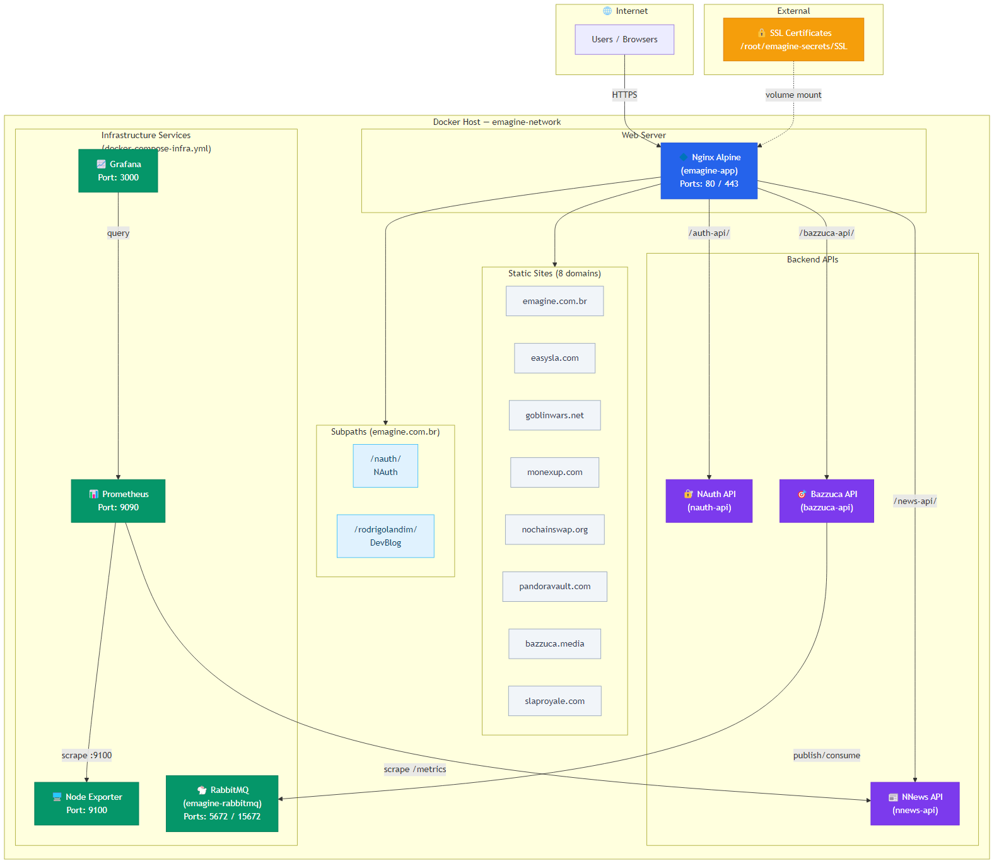

# emagine-deploy - Multi-Site Docker Deployment System


## Overview

**emagine-deploy** is a Docker-based multi-site deployment system that serves 8+ web applications through a single Nginx Alpine container with SSL termination and virtual hosting. Each site has its own domain, SSL certificate, and build pipeline. Built using **Nginx**, **Docker**, and **PowerShell** build scripts.

The only project with source code in this repository is **emagine-site** (the main Emagine portfolio). All other projects (EasySLA, NAuth, NoChainSwap, DevBlog, etc.) live in sibling repositories — the build scripts pull, build, and copy their outputs into the `builds/` directory.

Infrastructure services (Prometheus, Grafana, Node Exporter, RabbitMQ) are managed through a separate `docker-compose-infra.yml` and deployed via a dedicated GitHub Actions workflow.

SSL certificates are stored externally in a separate `emagine-secrets` repository and mounted as a Docker volume — they are **not** included in this repository.

---

## 🚀 Features

- 🌐 **Multi-Domain Hosting** - Serves 8+ domains from a single Nginx container
- 🔒 **SSL/TLS Termination** - Per-domain SSL certificates with automatic HTTP→HTTPS redirect
- 🐳 **Single-Container Deployment** - All sites bundled into one lightweight Nginx Alpine image
- 🔄 **Automated Build Pipelines** - PowerShell scripts to build each project independently or all at once
- 🛡️ **Cloudflare Origin Protection** - 80/443 restricted to Cloudflare IP ranges via `ufw-docker` + `ufw route` (applied automatically on every deploy)
- 📦 **SPA Routing** - All server blocks use `try_files` for single-page application support
- 🔀 **Reverse Proxy** - API routing for NAuth, NNews, and Bazzuca backend services
- 🏷️ **Semantic Versioning** - GitVersion-based automatic tagging and release creation
- 🚀 **Auto Deployment** - GitHub Actions deploys automatically on push to `main`
- 💻 **Local Development** - Dedicated `docker-compose-local.yml` with no SSL dependency
- 📊 **Monitoring** - Prometheus + Grafana + Node Exporter for metrics and dashboards
- 🐇 **Message Broker** - Centralized RabbitMQ shared across projects
- 📝 **DevBlog** - Developer blog served at `emagine.com.br/rodrigolandim/`

---

## 🛠️ Technologies Used

### Infrastructure
- **Nginx Alpine** - Lightweight web server and reverse proxy
- **Docker / Docker Compose** - Containerization and orchestration

### Monitoring & Observability
- **Prometheus** - Metrics collection and storage (30-day retention)
- **Grafana** - Dashboards and visualization
- **Node Exporter** - Linux server metrics (CPU, memory, disk, network)
- **prometheus-net** - .NET application metrics (scraped from NNews API)

### Message Broker
- **RabbitMQ** - Centralized AMQP message broker with management UI

### emagine-site (Portfolio)
- **React 18** + **TypeScript** + **Vite** (SWC) - Frontend framework
- **shadcn/ui** + **Radix UI** + **Tailwind CSS** - UI components and styling
- **i18next** - Internationalization (English/Portuguese)
- **React Hook Form** + **Zod** - Form handling and validation
- **TanStack Query** - Server state management
- **Lucide React** - Icon library

### Build & CI/CD
- **PowerShell** - Build scripts for all projects
- **GitHub Actions** - Version tagging, release creation, production and infrastructure deployment
- **GitVersion** - Semantic version management

---

## 📁 Project Structure

```
emagine-deploy/
├── builds/                  # Built outputs for each project
│   ├── bazzuca-media/       # bazzuca.media
│   ├── devblog/             # emagine.com.br/rodrigolandim
│   ├── easysla-app/         # easysla.com/app
│   ├── easysla-site/        # easysla.com
│   ├── emagine/             # emagine.com.br
│   ├── goblinwars-reborn/   # goblinwars.net
│   ├── monexup/             # monexup.com
│   ├── nauth/               # emagine.com.br/nauth
│   ├── nochainswap/         # nochainswap.org
│   ├── pandoravault/        # pandoravault.com
│   └── slaproyale/          # slaproyale.com
├── emagine-site/            # React/TypeScript source (only source in this repo)
│   └── src/
│       ├── components/      # React components
│       ├── pages/           # Page components
│       ├── locales/         # i18n translation files
│       ├── hooks/           # Custom React hooks
│       └── lib/             # Utility functions
├── monitoring/              # Prometheus & Grafana configuration
│   ├── prometheus.yml       # Scrape configs (nnews-api, node-exporter)
│   └── grafana/
│       ├── dashboards/      # Pre-configured JSON dashboards
│       │   ├── nnews-api.json
│       │   └── node-exporter.json
│       └── provisioning/    # Grafana auto-provisioning
│           ├── datasources/
│           └── dashboards/
├── scripts/                 # PowerShell build scripts (.ps1)
├── docs/                    # System design diagrams
├── assets/                  # Brand images and logos
├── .github/workflows/       # CI/CD workflows
├── Dockerfile               # Nginx Alpine container definition
├── docker-compose.yml       # Production web server
├── docker-compose-infra.yml # Infrastructure (Prometheus, Grafana, RabbitMQ, Node Exporter)
├── docker-compose-local.yml # Local development (no SSL, HTTP only)
├── nginx.conf               # Production virtual host config (multi-domain, SSL)
├── nginx-local.conf         # Local config (all sites on localhost via subpaths)
├── .env.example             # Environment variables template
├── GitVersion.yml           # Semantic versioning configuration
└── README.md                # This file
```

### Hosted Domains

| Domain | Project | Path |
|--------|---------|------|
| **emagine.com.br** | Emagine Portfolio | `/` |
| **emagine.com.br/nauth/** | NAuth | Subpath |
| **emagine.com.br/rodrigolandim/** | DevBlog | Subpath |
| **easysla.com** | EasySLA Site | `/` |
| **easysla.com/app** | EasySLA App | Subpath |
| **goblinwars.net** | Goblin Wars Reborn | `/` |
| **monexup.com** | MonexUp | `/` |
| **slaproyale.com** | Slap Royale | `/` |
| **nochainswap.org** | NoChainSwap | `/` |
| **pandoravault.com** | PandoraVault | `/` |
| **bazzuca.media** | Bazzuca Media | `/` |

### Ecosystem

All projects except emagine-site live in sibling repositories:

| Project | Source Repository | Build Script |
|---------|-------------------|--------------|
| **Emagine** | Local `emagine-site/` | `build-emagine.ps1` |
| **EasySLA** | `../EasySLA` | `build-easysla.ps1` |
| **NAuth** | `../NAuth/nauth-react` | `build-nauth.ps1` |
| **Goblin Wars** | `../gwr-website` | `build-goblinwars.ps1` |
| **NoChainSwap** | `../NoChainSwap` | `build-nochainswap.ps1` |
| **PandoraVault** | `../PandoraVault` | `build-pandoravault.ps1` |
| **Bazzuca Media** | `../BazzucaMedia` | `build-bazzucamedia.ps1` |
| **Slap Royale** | `../SlapRoyale` | `build-slaproyale.ps1` |
| **MonexUp** | `../MonexUp` | `build-monexup.ps1` |
| **DevBlog** | `../devblog` | `build-devblog.ps1` |

---

## 🏗️ System Design

The following diagram illustrates the high-level architecture of **emagine-deploy**:



The system is composed of three layers:

- **Web Server** — A single Nginx Alpine container serves all static sites and proxies API requests to backend containers (`nauth-api`, `nnews-api`, `bazzuca-api`) on the shared `emagine-network`.
- **Infrastructure Services** — Managed via `docker-compose-infra.yml`: Prometheus scrapes metrics from NNews API (prometheus-net) and Node Exporter; Grafana provides dashboards; RabbitMQ serves as a centralized message broker.
- **External** — SSL certificates are stored outside the repository and mounted as a read-only volume.

> 📄 **Source:** The editable Mermaid source is available at [`docs/system-design.mmd`](docs/system-design.mmd).

---

## ⚙️ Environment Configuration

Before running the infrastructure services, configure the environment variables:

### 1. Copy the environment template

```bash
cp .env.example .env
```

### 2. Edit the `.env` file

```bash
# RabbitMQ
RABBITMQ_USER=guest
RABBITMQ_PASSWORD=your_secure_rabbitmq_password_here

# Grafana
GRAFANA_USER=admin
GRAFANA_PASSWORD=your_secure_grafana_password_here
```

⚠️ **IMPORTANT**:
- Never commit the `.env` file with real credentials
- Only the `.env.example` should be version controlled
- Change all default passwords and secrets before deployment

---

## 🐳 Docker Setup

### Production (Web Server)

Production uses `docker-compose.yml` which mounts SSL certificates from `/root/emagine-secrets/SSL` on the server.

#### 1. Prerequisites

```bash
# Create the external Docker network (one-time setup)
docker network create emagine-network
```

#### 2. Build All Projects

```powershell
# Build all projects (pulls from sibling repos, outputs to builds/)
./scripts/build-all.ps1
```

#### 3. Build and Start Container

```bash
docker compose up -d --build
```

#### 4. Verify Deployment

```bash
docker compose ps
docker compose logs -f
```

### Infrastructure (Monitoring & RabbitMQ)

Infrastructure uses `docker-compose-infra.yml` for Prometheus, Grafana, Node Exporter, and RabbitMQ.

```bash
docker compose -f docker-compose-infra.yml up -d
```

| Service | URL | Description |
|---------|-----|-------------|
| **Grafana** | http://localhost:3000 | Dashboards and visualization |
| **Prometheus** | http://localhost:9090 | Metrics query interface |
| **RabbitMQ Management** | http://localhost:15672 | Message broker management UI |
| **Node Exporter** | http://localhost:9100 | Linux server metrics |

#### Pre-configured Grafana Dashboards

| Dashboard | Metrics |
|-----------|---------|
| **NNews API** | Request rate, duration (p50/p95/p99), HTTP status codes, error rate, .NET GC, thread pool, process CPU/memory |
| **Linux Server** | CPU usage, memory, swap, disk usage/IO, network traffic, system load, uptime |

### Local Development

Local uses `docker-compose-local.yml` + `nginx-local.conf` — **no SSL required**. All sites are served on `http://localhost` via subpaths.

```bash
docker compose -f docker-compose-local.yml up -d --build
```

| Site | Local URL |
|------|-----------|
| **Emagine** | http://localhost/ |
| **NAuth** | http://localhost/nauth/ |
| **DevBlog** | http://localhost/rodrigolandim/ |
| **Goblin Wars** | http://localhost/goblinwars/ |
| **MonexUp** | http://localhost/monexup/ |
| **EasySLA Site** | http://localhost/easysla/ |
| **EasySLA App** | http://localhost/easysla-app/ |
| **NoChainSwap** | http://localhost/nochainswap/ |
| **PandoraVault** | http://localhost/pandoravault/ |
| **Bazzuca Media** | http://localhost/bazzuca/ |

### Docker Compose Commands

| Action | Command |
|--------|---------|
| Start web server | `docker compose up -d` |
| Start with rebuild | `docker compose up -d --build` |
| Start infrastructure | `docker compose -f docker-compose-infra.yml up -d` |
| Stop services | `docker compose stop` |
| Full rebuild | `docker compose up -d --build --force-recreate` |
| View status | `docker compose ps` |
| View logs | `docker compose logs -f` |
| Remove containers | `docker compose down` |

---

## 🔧 Local Development (emagine-site)

### Prerequisites
- Node.js (LTS)
- npm

### Setup

```bash
cd emagine-site
npm install
npm run dev       # Vite dev server
```

### Available Scripts

| Script | Command | Description |
|--------|---------|-------------|
| Dev server | `npm run dev` | Start Vite development server |
| Build | `npm run build` | Production build to `dist/` |
| Preview | `npm run preview` | Preview production build locally |
| Lint | `npm run lint` | Run ESLint |

---

## 🔧 Build Scripts

Build individual projects or all at once using PowerShell:

```powershell
# Build a single project
./scripts/build-emagine.ps1       # Builds from local emagine-site/
./scripts/build-easysla.ps1       # Pulls from ../EasySLA
./scripts/build-nauth.ps1         # Pulls from ../NAuth/nauth-react
./scripts/build-goblinwars.ps1    # Pulls from ../gwr-website
./scripts/build-nochainswap.ps1   # Pulls from ../NoChainSwap
./scripts/build-pandoravault.ps1  # Pulls from ../PandoraVault
./scripts/build-bazzucamedia.ps1  # Pulls from ../BazzucaMedia
./scripts/build-slaproyale.ps1    # Pulls from ../SlapRoyale
./scripts/build-monexup.ps1       # Pulls from ../MonexUp
./scripts/build-devblog.ps1       # Pulls from ../devblog

# Build everything
./scripts/build-all.ps1
```

Build outputs are always placed in the `builds/` directory.

---

## 🔒 Security Features

### SSL/TLS
- **Per-domain certificates** - Each domain has its own SSL certificate and key
- **External secrets** - SSL certificates stored in a separate `emagine-secrets` repository, never committed to this repo
- **HTTP to HTTPS redirect** - All HTTP traffic is automatically redirected to HTTPS
- **www redirect** - `www.` subdomains redirect to the apex domain

### Nginx
- **Read-only config** - `nginx.conf` is mounted as a read-only volume
- **SPA fallback** - All routes fall back to `index.html` for client-side routing
- **CORS headers** - Configured for API proxy locations with preflight support

### Cloudflare Origin (proxied)
- **Origin certificates** - All domains use Cloudflare Origin Certificates (`*.pem`) — only the Cloudflare edge can validate them, hiding the real cert chain
- **Real-client IP** - Each server block restores the visitor IP from `CF-Connecting-IP` via `set_real_ip_from` (Cloudflare IPv4 + IPv6 ranges), so backend services see the real address in `X-Real-IP`/`X-Forwarded-For`

---

## 🛡️ Cloudflare Firewall (80/443 origin protection)

Once domains sit behind the Cloudflare proxy (orange cloud), ports **80** and **443** on the origin should accept connections **only** from Cloudflare's IP ranges. This hides the origin from direct scans, drive-by exploits and DDoS attempts that bypass Cloudflare by hitting the IP directly.

### Why a dedicated script (and not just `ufw allow`)

`ufw` does **not** filter traffic destined to Docker-published ports — Docker installs its own DNAT rules in the `DOCKER` chain that bypass `ufw`'s `INPUT` chain. The correct filter point is the **`DOCKER-USER`** chain, reached via:

1. the hook from [`chaifeng/ufw-docker`](https://github.com/chaifeng/ufw-docker) installed in `/etc/ufw/after.rules`, plus
2. rules added with `ufw route allow proto tcp from <cidr> to any port 80,443` (not `ufw allow`).

Two scripts in `scripts/` encapsulate this:

| Script | Purpose | When it runs |
|--------|---------|--------------|
| [`scripts/cf-firewall-bootstrap.sh`](scripts/cf-firewall-bootstrap.sh) | Installs the `ufw-docker` hook + `systemctl restart ufw` | **Manual**, one-off (or after Docker networks change) |
| [`scripts/cf-firewall-docker.sh`](scripts/cf-firewall-docker.sh) | Downloads Cloudflare ranges and rewrites `ufw route allow` rules tagged `cf-proxy` (idempotent, IPv4 + IPv6) | **Automatic** on every `deploy-prod.yml`, optional weekly cron |

### Implementation process

#### Step 1 — Prerequisite (one-off, in Cloudflare dashboard)

For each domain in [`nginx.conf`](nginx.conf):
- DNS record set to **proxied** (orange cloud)
- SSL/TLS encryption mode: **Full (strict)**
- Origin certificate (`*.pem`) placed in `/root/emagine-secrets/SSL/` on the server

The current `nginx.conf` already assumes these are in place for all 9 hosted domains.

#### Step 2 — Bootstrap (manual, one-off per server)

The bootstrap reboots `ufw`, creating a few seconds of blocked 80/443. By design it never runs from CI. SSH into the server and run:

```bash
cd /opt/emagine-deploy
git pull

# Install the ufw-docker hook + restart ufw (brief 80/443 blip)
sudo CF_FW_BOOTSTRAP=1 bash scripts/cf-firewall-bootstrap.sh

# Apply Cloudflare ranges immediately afterward
sudo bash scripts/cf-firewall-docker.sh
```

Re-run **both** commands whenever Docker networks are created or removed on the host — the `ufw-docker install` regenerates `after.rules` based on the networks present at run time.

#### Step 3 — Apply (automatic, on every deploy)

`deploy-prod.yml` calls `scripts/cf-firewall-docker.sh` right after `docker compose up -d`. The script:

- **Aborts** if the SSH rule (`22/tcp`) is missing — anti-lockout guard before any change.
- **Aborts** if the Cloudflare IP lists fail to download or come back malformed — fail-safe so 80/443 are never accidentally opened to the world or left without protection.
- **Does not fail the deploy** if the `ufw-docker` hook is absent — it logs a warning and exits 0, so deploys keep working until the bootstrap is run.
- Regenerates rules tagged `cf-proxy` (IPv4 + IPv6, both ports) — no duplicates across reruns.

#### Optional — weekly cron as a safety net

Cloudflare ranges change rarely, but a cron captures updates between deploys. On the server:

```cron
# /etc/cron.d/cf-firewall
17 4 * * 1 root /usr/bin/bash /opt/emagine-deploy/scripts/cf-firewall-docker.sh >> /var/log/cf-firewall.log 2>&1
```

### Verification

After bootstrap + apply, on the server:

```bash
sudo ufw status | grep -w 22/tcp        # must remain LIMIT IN Anywhere
sudo ufw status | grep cf-proxy | wc -l # ~44 rules expected (~22 ranges × 2 ports)
```

From a host **outside** Cloudflare's network:

```bash
curl -m5 -I http://<server_public_ip>   # should time out / connection refused
curl -m5 -I https://emagine.com.br      # should respond 200/301 via Cloudflare
```

> 📄 **Full reference (invariants, troubleshooting, rollback):** [`docs/CF_FIREWALL.md`](docs/CF_FIREWALL.md)

---

## 🔄 CI/CD

### GitHub Actions

Four workflows automate versioning, deployment, and infrastructure:

**1. Version and Tag** (`version-tag.yml`)
- **Triggers:** Push to `main`, manual dispatch
- Uses GitVersion to calculate semantic version
- Creates and pushes a git tag (e.g., `v1.2.3`)

**2. Create Release** (`create-release.yml`)
- **Triggers:** After "Version and Tag" completes successfully
- Creates a GitHub Release for minor/major version bumps
- Auto-generates release notes from commits

**3. Deploy Production** (`deploy-prod.yml`)
- **Triggers:** After "Version and Tag" completes, manual dispatch
- Verifies SSL directory exists on the server (`/root/emagine-secrets/SSL`)
- Connects via SSH to the production server
- Pulls latest code and runs `docker compose up --build -d`
- Reapplies Cloudflare firewall rules via `scripts/cf-firewall-docker.sh` — idempotent; warns and continues if the `ufw-docker` hook hasn't been installed yet (see [Cloudflare Firewall](#-cloudflare-firewall-80443-origin-protection))

**4. Deploy Infrastructure** (`deploy-infra.yml`)
- **Triggers:** Manual dispatch only (`workflow_dispatch`)
- Sequential jobs: Setup → RabbitMQ → Node Exporter → Prometheus → Grafana → Verify
- Creates `.env` on server from GitHub Secrets
- Deploys all infrastructure services via `docker-compose-infra.yml`

### Version Convention (GitVersion)

| Branch Pattern | Increment | Tag |
|---------------|-----------|-----|
| `main` | Patch | _(none)_ |
| `dev`/`develop` | Minor | `alpha` |
| `feature/*` | Minor | `alpha` |
| `release/*` | Patch | `beta` |
| `hotfix/*` | Patch | _(none)_ |

Commit message prefixes: `major:` / `breaking:` for major, `feat:` / `feature:` for minor, `fix:` / `patch:` for patch.

---

## 🔍 Troubleshooting

### Common Issues

#### Container fails to start

**Check:**
```bash
docker compose logs emagine-app
```

**Common causes:**
- Missing build outputs in `builds/` — run `./scripts/build-all.ps1` first
- Missing SSL certificates (production only) — ensure `/root/emagine-secrets/SSL` exists on the server
- Docker network `emagine-network` not created

**Solution:**
```bash
docker network create emagine-network
./scripts/build-all.ps1
docker compose up -d --build
```

#### Site returns 404

**Common causes:**
- Build output directory is empty or missing
- Nginx config path doesn't match the build output path

**Check:**
```bash
docker exec emagine-app1 ls /var/www/
```

#### Infrastructure services not connecting

**Common causes:**
- Docker network `emagine-network` doesn't exist
- `.env` file missing or misconfigured
- Services started in wrong order

**Solution:**
```bash
docker network create emagine-network
cp .env.example .env  # Edit with real credentials
docker compose -f docker-compose-infra.yml up -d
```

---

## 🚀 Deployment

### Development Environment

```bash
cd emagine-site
npm run dev
```

### Local Docker (all sites)

```bash
docker compose -f docker-compose-local.yml up -d --build
```

### Production (via GitHub Actions)

Production deploys automatically on every push to `main`. You can also trigger it manually from the GitHub Actions tab. The workflow SSHs into the server, verifies the SSL directory, pulls the latest code, and rebuilds the container.

### Infrastructure (via GitHub Actions)

Infrastructure is deployed manually via the "Deploy Infrastructure" workflow in GitHub Actions. It deploys RabbitMQ, Node Exporter, Prometheus, and Grafana sequentially.

---

## 🤝 Contributing

Contributions are welcome! Please feel free to submit a Pull Request.

### Development Setup

1. Fork the repository
2. Create a feature branch (`git checkout -b feature/AmazingFeature`)
3. Make your changes
4. Commit your changes (`git commit -m 'feat: Add some AmazingFeature'`)
5. Push to the branch (`git push origin feature/AmazingFeature`)
6. Open a Pull Request

### Key Conventions

- Build outputs always go to `builds/` (never the repo root)
- SSL certs stored externally in `../emagine-secrets/SSL/` (mounted as volume)
- `nginx.conf` is mounted as a read-only volume
- SPA routing: all nginx server blocks use `try_files $uri $uri/ /index.html`
- NAuth is served as a subpath under `emagine.com.br/nauth/`
- DevBlog is served as a subpath under `emagine.com.br/rodrigolandim/`
- EasySLA has two builds: site (root) and app (`/app` subpath)

---

## 👨‍💻 Author

Developed by **[Rodrigo Landim Carneiro](https://github.com/landim32)**

---

## 📄 License

This project is licensed under the **MIT License** - see the [LICENSE](LICENSE) file for details.

---

## 📞 Support

- **Issues**: [GitHub Issues](https://github.com/emaginebr/emagine-deploy/issues)

---

**⭐ If you find this project useful, please consider giving it a star!**
